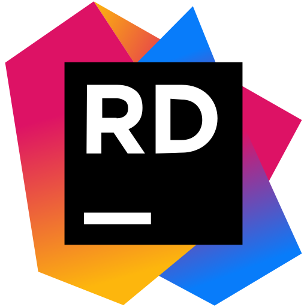
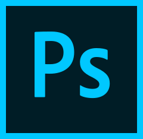

  

<h3 align="left">Languages and Tools:</h3>

 
  
  
  
   
   
   
   
   
  
  
  
  
  
  
   
   
   
  
  
   
   
  
   
  
   
   
  
  
  
  
  
   
  
  
   
   
  
   

<h3 align="left">Connect with me:</h3>

  

  

<!--
  
-->
